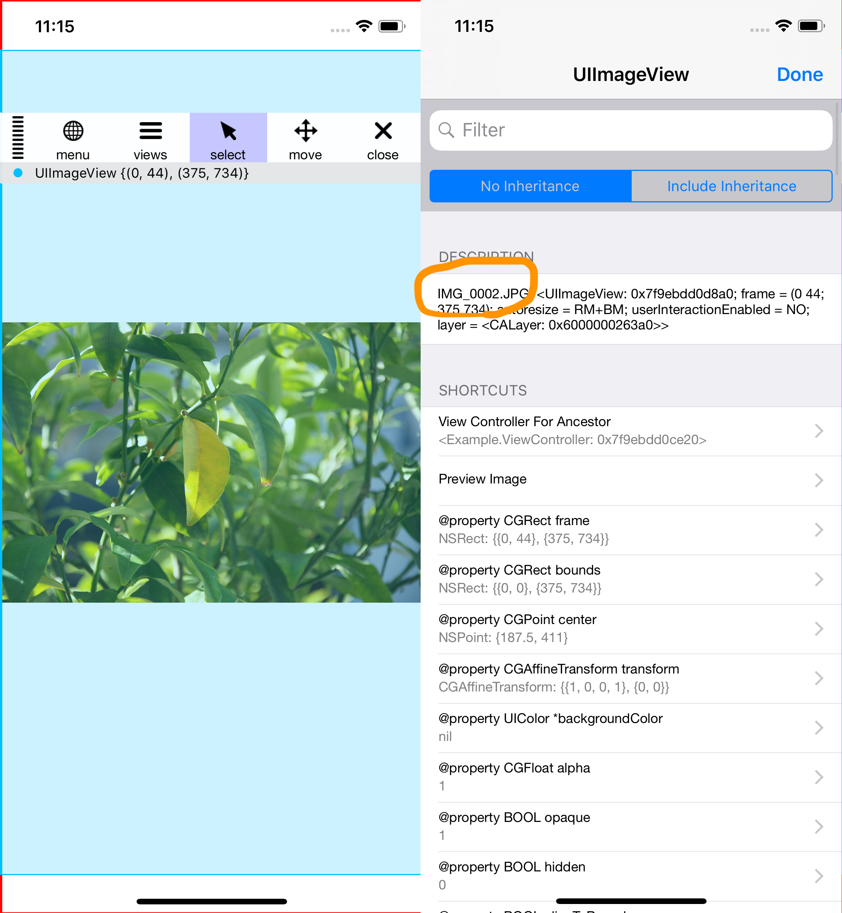

# HHUIImageNamed

HHUIImageNamed is drop-in style debugging tool to track image's file name when we use `+[UIImage imageNamed]`, `-[UIImage imageWithContentsOfFile]` and so on.

[](https://travis-ci.org/hyukhur/HHUIImageNamed)
[](https://github.com/hyukhur/HHUIImageNamed)
[](https://codebeat.co/projects/github-com-hyukhur-hhuiimagenamed-master)
<!--
[](https://github.com/hyukhur/HHUIImageNamed/tree/master/HHUIImageNamed/Classes)
-->
[](https://developer.apple.com)
[](https://github.com/Carthage/Carthage)
[](https://cocoapods.org/pods/HHUIImageNamed)
[](https://github.com/hyukhur/HHUIImageNamed/blob/master/LICENSE)
[](http://cocoapods.org/pods/HHUIImageNamed)
[](https://twitter.com/intent/tweet?text=Wow:&url=https%3A%2F%2Fgithub.com%2Fhyukhur%2FHHUIImageNamed)

## Example
To see the example codes, check the unit test codes.
If you couldn't find proper function, let me know. [](https://github.com/hyukhur/HHUIImageNamed/issues)

If you use exploration tools like [FLEX](https://github.com/Flipboard/FLEX), you could find out which file makes the image.



## Requirements
* iOS8 or later
  * Actually it's iOS5+. There is no limitation if you can import it.

## Installation

HHUIImageNamed is available through [CocoaPods](http://cocoapods.org). To install it, simply add the following line to your Podfile:

```ruby
  pod 'HHUIImageNamed'
  
  post_install do |installer|
    installer.pods_project.targets.each do |target|
      if target.name.include? "HHUIImageNamed"
        target.build_configurations.each do |config|
          if config.name == 'Debug'
            config.build_settings['GCC_PREPROCESSOR_DEFINITIONS'] ||= ['$(inherited)', 'USE_PRIVATE=1']
          end
        end
      end
    end
  end
```

### Carthage

```ruby
github "hyukhur/HHUIImageNamed"
```
```bash
$ carthage build HHUIImageNamed --configuration Debug
```

## Usage
🚨 It contains "Private API" for Storyboard. Be careful it doesn't contain in your product package.
There is MACRO to control whether it has or not, which is called "USE_PRIVATE". you could find it in `HHUIImageNamed.h`.
Release configuration set it zero by default not to use "Private API".
Even if you won't like to use "Private API", you could track image file names in limitated situations.

Just Drop-in 'HHUIImageNamed' and trace the image name.

## Author

Hyuk Hur

## License

HHUIImageNamed is available under the MIT license. See the LICENSE file for more info.
[](https://github.com/hyukhur/HHUIImageNamed/blob/master/LICENSE)

